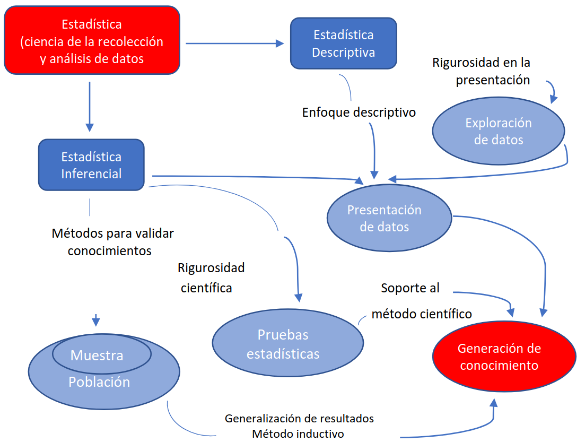

# Clase 01 - Introducción a la Estadística Descriptiva

En esta clase se presenta una introducción estructurada y rigurosa a los **conceptos fundamentales de la estadística descriptiva**, con un enfoque académico y aplicado, basado en textos clásicos de estadística utilizados en ingeniería y ciencias (Devore, Mendenhall, Montgomery, Johnson & Wichern).

---

## 1. ¿Qué es la estadística descriptiva?

La **estadística descriptiva** es la rama de la estadística que se encarga de **recolectar, organizar, resumir y presentar datos** con el objetivo de describir las características principales de un conjunto de observaciones.

Su propósito central es **transformar datos crudos en información comprensible**, utilizando resúmenes numéricos, tablas y representaciones gráficas.

### 1.1. Diferencia entre estadística descriptiva e inferencial

| Estadística descriptiva                | Estadística inferencial                     |
| -------------------------------------- | ------------------------------------------- |
| Resume y organiza datos observados     | Generaliza conclusiones a una población     |
| No realiza predicciones                | Realiza estimaciones y pruebas de hipótesis |
| Usa tablas, gráficos y medidas resumen | Usa probabilidad y modelos estadísticos     |
| No cuantifica incertidumbre            | Cuantifica el error y el riesgo             |

La estadística descriptiva **no va más allá de los datos disponibles**, mientras que la inferencial utiliza muestras para obtener conclusiones sobre poblaciones.

### 1.2. ¿Qué es un estudio estadístico?

Un **estudio estadístico** es un proceso sistemático que involucra las siguientes etapas:

1. **Definición del problema**: Identificar qué se quiere estudiar y por qué.
2. **Recopilación de datos**: Obtener información de la población o muestra.
3. **Organización y resumen**: Tabular y graficar los datos.
4. **Análisis**: Calcular medidas descriptivas y patrones.
5. **Interpretación**: Extraer conclusiones y comunicar resultados.

### 1.3. Importancia de la estadística descriptiva

La estadística descriptiva es esencial porque:

* Permite **entender patrones, tendencias y variabilidad** en los datos.
* Es el **primer paso obligatorio** antes de cualquier análisis inferencial o modelado.
* Facilita la **detección de errores, valores atípicos y sesgos**.
* Sirve como base para la **toma de decisiones informadas** en ingeniería, economía y ciencias.

### 1.4. Aplicaciones de la estadística descriptiva

* Control de calidad y procesos industriales
* Análisis exploratorio de datos (EDA)
* Estudios de mercado y encuestas
* Ciencias de la salud y epidemiología
* Ingeniería y experimentación científica
* Ciencia de datos y aprendizaje automático

---

## 2. Conceptos clave

### 2.1. Población y muestra

* **Población**: Conjunto total de elementos u observaciones de interés.
* **Muestra**: Subconjunto representativo de la población.

Generalmente, estudiar toda la población (censo) es costoso o inviable, por lo que se trabaja con muestras.

### 2.1.1. Recopilación de datos y técnicas de muestreo

#### Tipos de muestreo probabilístico

En el muestreo probabilístico, cada elemento de la población tiene una **probabilidad conocida y no nula** de ser seleccionado. Esto permite aplicar inferencia estadística y cuantificar el error muestral.

**a) Muestreo aleatorio simple**
Consiste en seleccionar una muestra de tamaño (n) de una población de tamaño (N) de tal forma que **todas las muestras posibles tengan la misma probabilidad de ser elegidas**.

*Ejemplo:*
Si una fábrica produce 1,000 piezas y se desea inspeccionar 50, se puede numerar cada pieza del 1 al 1,000 y seleccionar 50 números al azar usando una tabla de números aleatorios o un generador computacional.

**b) Muestreo sistemático**
Se selecciona un punto de inicio aleatorio y luego se elige cada (k)-ésimo elemento, donde (k = N/n).

*Ejemplo:*
En un registro de 2,000 clientes se desea una muestra de 200. Se calcula (k = 2000/200 = 10). Si el primer cliente se selecciona aleatoriamente entre los primeros 10, luego se elige cada décimo cliente.

**c) Muestreo estratificado**
La población se divide en **estratos homogéneos** (grupos similares internamente) y se toma una muestra aleatoria de cada estrato.

*Ejemplo:*
En una universidad, los estudiantes se dividen en estratos según la carrera (ingeniería, ciencias sociales, salud). Se selecciona una muestra aleatoria proporcional de cada carrera para garantizar representatividad.

**d) Muestreo por conglomerados**
La población se divide en **conglomerados heterogéneos**, se seleccionan algunos conglomerados al azar y se estudian todos los elementos dentro de ellos (o una muestra interna).

*Ejemplo:*
Para evaluar el rendimiento académico en una ciudad, se seleccionan aleatoriamente ciertas escuelas (conglomerados) y se evalúa a todos los estudiantes de las escuelas seleccionadas.

---

#### Tipos de muestreo no probabilístico

En el muestreo no probabilístico, la probabilidad de selección de los elementos **no es conocida**, por lo que no es posible medir formalmente el error muestral. Se usa principalmente en estudios exploratorios.

**a) Muestreo por conveniencia**
La muestra se selecciona según la **facilidad de acceso** a los elementos.

*Ejemplo:*
Un investigador encuesta a los primeros 100 estudiantes que encuentra en la biblioteca.

**b) Muestreo por juicio (o intencional)**
El investigador selecciona los elementos que considera **más representativos** según su experiencia o criterio.

*Ejemplo:*
Un experto en calidad selecciona piezas que, según su experiencia, representan los casos más críticos del proceso productivo.

**c) Muestreo por cuotas**
La población se divide en categorías y se fija una cuota para cada una, pero la selección dentro de cada grupo no es aleatoria.

*Ejemplo:*
En un estudio de mercado se encuestan 50 hombres y 50 mujeres, seleccionados libremente hasta completar cada cuota.

### 2.2. Parámetro, estimador, estimación y estadístico

* **Parámetro**: Valor numérico que describe una población (μ, σ²).
* **Estadístico**: Función calculada a partir de una muestra (\bar{x}, s²).
* **Estimador**: Regla o fórmula usada para aproximar un parámetro.
* **Estimación**: Valor numérico obtenido al aplicar el estimador.

Ejemplo:

* Parámetro: media poblacional μ
* Estimador: media muestral \bar{x}
* Estimación: valor concreto de \bar{x}

---

## 3. Métodos pictóricos y tabulares

Los métodos gráficos permiten **visualizar la distribución y variabilidad** de los datos.

### 3.1. Notaciones

* n: tamaño de la muestra
* xᵢ: i-ésima observación
* fᵢ: frecuencia absoluta
* hᵢ: frecuencia relativa
* Fᵢ: frecuencia acumulada

### 3.2. Gráfico de tallos y hojas

Representación que conserva los valores originales y permite identificar la forma de la distribución. Es útil para conjuntos de datos pequeños o medianos.

### 3.3. Gráficos de puntos y diagrama de Pareto

* **Gráfico de puntos**: cada observación se representa sobre una recta numérica.
* **Diagrama de Pareto**: gráfico de barras ordenadas de mayor a menor frecuencia, acompañado de una curva acumulada. Se usa en control de calidad (regla 80–20).

### 3.4. Histogramas

Representan la distribución de frecuencias de una variable cuantitativa continua mediante intervalos de clase.

#### 3.4.1. Formas de histogramas

* **Simétrico**: distribución equilibrada alrededor del centro.
* **Asimétrico**: sesgo a la derecha o izquierda.
* **Bimodal**: dos picos dominantes.
* **Uniforme**: frecuencias aproximadamente constantes.

### 3.5. Gráficos de barras

Se utilizan para variables categóricas o discretas. La altura de cada barra representa la frecuencia o proporción.

### 3.6. Gráficos circulares

También llamados gráficos de pastel. Representan proporciones relativas de categorías. Son útiles para comparaciones simples, pero poco recomendables para análisis detallados.

### 3.7. Polígonos de frecuencia

Se construyen uniendo los puntos medios de las clases de un histograma. Permiten comparar varias distribuciones en un mismo gráfico.

### 3.8. Ojivas

Gráficos de frecuencias acumuladas. Son útiles para:

* Determinar percentiles
* Analizar la distribución acumulada
* Comparar muestras

---

## Referencias

1. Casella, G., & Berger, R. L. (2002). *Statistical Inference* (2nd ed.). Duxbury Press.
2. Devore, J. L. (2012). *Probabilidad y estadística para ingeniería y ciencias* (7a ed.). Cengage Learning.
3. Lane, D. M. (2013). *Introduction to Statistics*. Rice University.
4. Miller, I., & Freund, J. E. (2010). *Mathematical Statistics with Applications* (7th ed.). Pearson.
5. Miller, I., & Freund, J. E. (2004). *Probabilidad y estadística para ingenieros*. Pearson Educación.
6. Ross, S. M. (2010). *Introductory Statistics*. Academic Press.
7. Ross, S. M. (2014). *A First Course in Probability* (8th ed.). Pearson.
8. Scheaffer, R. L., McClave, J. T., & Young, L. J. (2010). *Probabilidad y estadística para ingeniería*. Cengage Learning.
9. Walpole, R. E., Myers, R. H., Myers, S. L., & Ye, K. (2012). *Probabilidad y estadística para ingeniería y ciencias* (8a ed.). Pearson.
10. Weimer, R. C. (2003). *Estadística*. Addison-Wesley.
11. Wackerly, D. D., Mendenhall, W., & Scheaffer, R. L. (2008). *Estadística matemática con aplicaciones* (7a ed.). Cengage Learning.
12. Bruce, P., Bruce, A., & Gedeck, P. (2020). *Practical Statistics for Data Scientists: 50+ Essential Concepts Using R and Python* (2nd ed.). O’Reilly Media.
13. Arreguín Samaniego, M. (2016). *Estadística para ingeniería*. Editorial universitaria.

