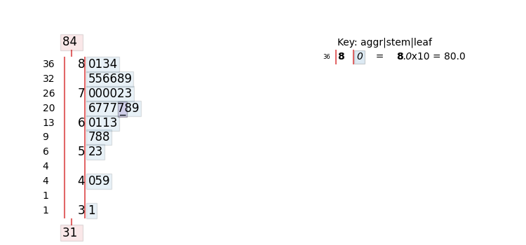
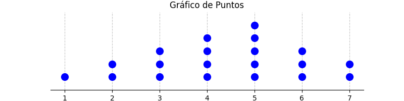
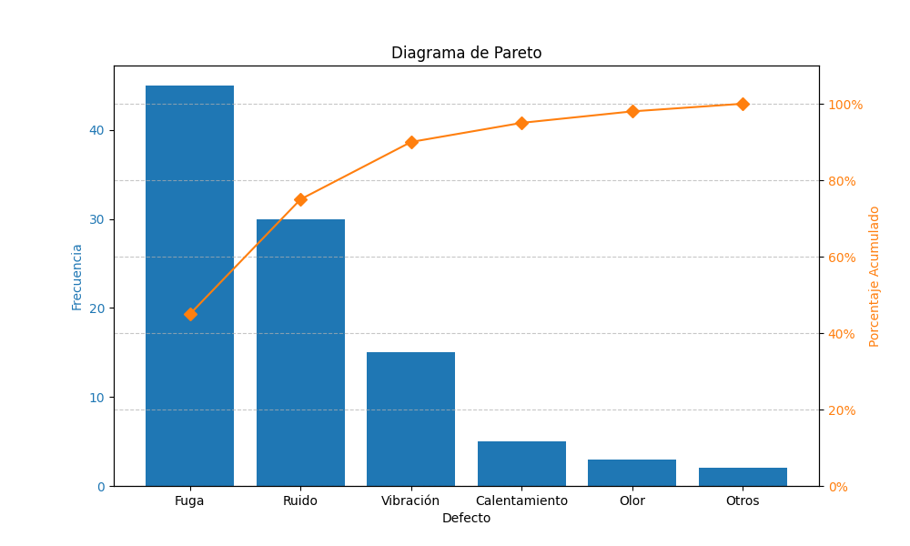
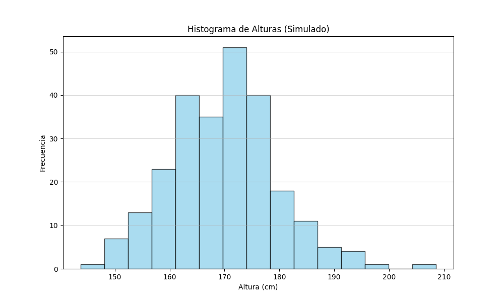
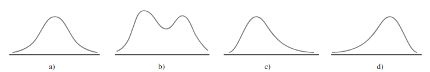
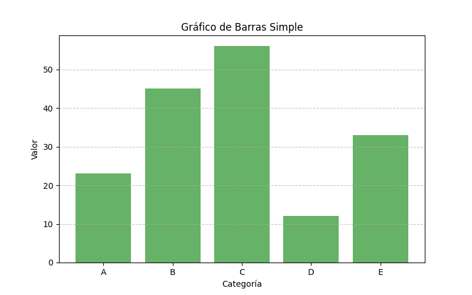
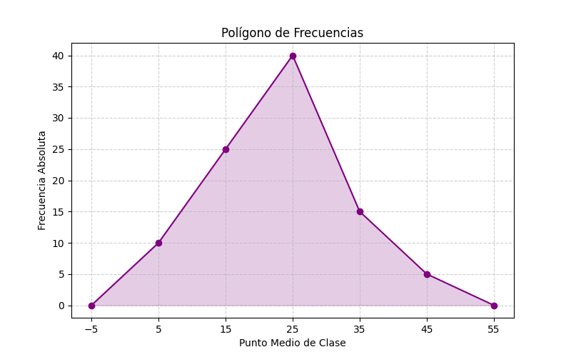
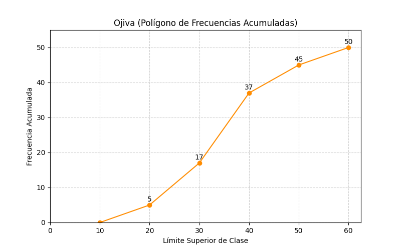

# Clase 01 - Introducción a la Estadística Descriptiva

En esta clase se presenta una introducción estructurada y rigurosa a los **conceptos fundamentales de la estadística descriptiva**, con un enfoque académico y aplicado, basado en textos clásicos de estadística utilizados en ingeniería y ciencias (Devore, Mendenhall, Montgomery, Johnson & Wichern).

---

## 1. ¿Qué es la estadística descriptiva?

La **estadística descriptiva*- es la rama de la estadística que se encarga de **recolectar, organizar, resumir y presentar datos*- con el objetivo de describir las características principales de un conjunto de observaciones.

Su propósito central es **transformar datos crudos en información comprensible**, utilizando resúmenes numéricos, tablas y representaciones gráficas.

### 1.1. Diferencia entre estadística descriptiva e inferencial

| Estadística descriptiva                | Estadística inferencial                     |
| -------------------------------------- | ------------------------------------------- |
| Resume y organiza datos observados     | Generaliza conclusiones a una población     |
| No realiza predicciones                | Realiza estimaciones y pruebas de hipótesis |
| Usa tablas, gráficos y medidas resumen | Usa probabilidad y modelos estadísticos     |
| No cuantifica incertidumbre            | Cuantifica el error y el riesgo             |

La estadística descriptiva **no va más allá de los datos disponibles**, mientras que la inferencial utiliza muestras para obtener conclusiones sobre poblaciones.


**Figura 1**. División de la estadística. Adaptado de "Estadística para ingeniería" por M. Arreguín Samaniego, 2016, Editorial universitaria.

### 1.2. ¿Qué es un estudio estadístico?

Un **estudio estadístico*- es un proceso sistemático que involucra las siguientes etapas:

1. **Definición del problema**: Identificar qué se quiere estudiar y por qué.
2. **Recopilación de datos**: Obtener información de la población o muestra.
3. **Organización y resumen**: Tabular y graficar los datos.
4. **Análisis**: Calcular medidas descriptivas y patrones.
5. **Interpretación**: Extraer conclusiones y comunicar resultados.

### 1.3. Importancia de la estadística descriptiva

La estadística descriptiva es esencial porque:

- Permite **entender patrones, tendencias y variabilidad*- en los datos.
- Es el **primer paso obligatorio*- antes de cualquier análisis inferencial o modelado.
- Facilita la **detección de errores, valores atípicos y sesgos**.
- Sirve como base para la **toma de decisiones informadas*- en ingeniería, economía y ciencias.

### 1.4. Aplicaciones de la estadística descriptiva

- Control de calidad y procesos industriales
- Análisis exploratorio de datos (EDA)
- Estudios de mercado y encuestas
- Ciencias de la salud y epidemiología
- Ingeniería y experimentación científica
- Ciencia de datos y aprendizaje automático

---

## 2. Conceptos clave

### 2.1. Población y muestra

- **Población**: Conjunto total de elementos u observaciones de interés.
- **Muestra**: Subconjunto representativo de la población.

Generalmente, estudiar toda la población (censo) es costoso o inviable, por lo que se trabaja con muestras.

### 2.1.1. Recopilación de datos y técnicas de muestreo

#### Tipos de muestreo probabilístico

En el muestreo probabilístico, cada elemento de la población tiene una **probabilidad conocida y no nula*- de ser seleccionado. Esto permite aplicar inferencia estadística y cuantificar el error muestral.

**a) Muestreo aleatorio simple**
Consiste en seleccionar una muestra de tamaño (n) de una población de tamaño (N) de tal forma que **todas las muestras posibles tengan la misma probabilidad de ser elegidas**.

*Ejemplo:*
Si una fábrica produce 1,000 piezas y se desea inspeccionar 50, se puede numerar cada pieza del 1 al 1,000 y seleccionar 50 números al azar usando una tabla de números aleatorios o un generador computacional.

**b) Muestreo sistemático**
Se selecciona un punto de inicio aleatorio y luego se elige cada (k)-ésimo elemento, donde (k = N/n).

*Ejemplo:*
En un registro de 2,000 clientes se desea una muestra de 200. Se calcula (k = 2000/200 = 10). Si el primer cliente se selecciona aleatoriamente entre los primeros 10, luego se elige cada décimo cliente.


**Figura 2**. Muestreo aleatorio simple y muestreo sistemático. Adaptado de "Estadística" por Mario R. Triolla, 2004, Person Education.

**c) Muestreo estratificado**
La población se divide en **estratos homogéneos*- (grupos similares internamente) y se toma una muestra aleatoria de cada estrato.

*Ejemplo:*
En una universidad, los estudiantes se dividen en estratos según la carrera (ingeniería, ciencias sociales, salud). Se selecciona una muestra aleatoria proporcional de cada carrera para garantizar representatividad.

**d) Muestreo por conglomerados**
La población se divide en **conglomerados heterogéneos**, se seleccionan algunos conglomerados al azar y se estudian todos los elementos dentro de ellos (o una muestra interna).

*Ejemplo:*
Para evaluar el rendimiento académico en una ciudad, se seleccionan aleatoriamente ciertas escuelas (conglomerados) y se evalúa a todos los estudiantes de las escuelas seleccionadas.


**Figura 3**. Muestreo estratificado y por conglomerados. Adaptado de "Estadística" por Mario R. Triolla, 2004, Person Education.

#### Tipos de muestreo no probabilístico

En el muestreo no probabilístico, la probabilidad de selección de los elementos **no es conocida**, por lo que no es posible medir formalmente el error muestral. Se usa principalmente en estudios exploratorios.

**a) Muestreo por conveniencia**
La muestra se selecciona según la **facilidad de acceso*- a los elementos.

*Ejemplo:*
Un investigador encuesta a los primeros 100 estudiantes que encuentra en la biblioteca.

**b) Muestreo por juicio (o intencional)**
El investigador selecciona los elementos que considera **más representativos*- según su experiencia o criterio.

*Ejemplo:*
Un experto en calidad selecciona piezas que, según su experiencia, representan los casos más críticos del proceso productivo.

**c) Muestreo por cuotas**
La población se divide en categorías y se fija una cuota para cada una, pero la selección dentro de cada grupo no es aleatoria.

*Ejemplo:*
En un estudio de mercado se encuestan 50 hombres y 50 mujeres, seleccionados libremente hasta completar cada cuota.

### 2.2. Parámetro, estimador, estimación y estadístico

- **Parámetro**: Valor numérico que describe una población (μ, σ²).
- **Estadístico**: Función calculada a partir de una muestra (\bar{x}, s²).
- **Estimador**: Regla o fórmula usada para aproximar un parámetro.
- **Estimación**: Valor numérico obtenido al aplicar el estimador.

Ejemplo:

- Parámetro: media poblacional μ
- Estimador: media muestral \bar{x}
- Estimación: valor concreto de \bar{x}

---

## 3. Métodos pictóricos y tabulares

Los métodos gráficos permiten **visualizar la distribución y variabilidad*- de los datos.

### 3.1. Notaciones

- n: tamaño de la muestra
- xᵢ: i-ésima observación
- fᵢ: frecuencia absoluta. El conteo puro. ¿Cuántas veces aparece este valor?
- hᵢ: frecuencia relativa. proporción. Es la frecuencia absoluta dividida por el total de datos. Nos dice qué parte del "todo" representa cada categoría.
- Fᵢ: frecuencia acumulada. La suma de las frecuencias absolutas hasta ese punto.
- Hᵢ: frecuencia relativa acumulada. La suma de las frecuencias relativas. Al final, siempre debe sumar 1 (100%)

#### 3.1.1. Tablas de frecuencia

En términos simples, es un resumen organizado de tus datos. Su objetivo es mostrar cómo se distribuyen los valores de una variable, permitiéndonos identificar patrones, valores dominantes o datos atípicos (outliers) de un solo vistazo.

**Ejemplo**. Imaginemos que ahora encuestamos a **20 estudiantes de Data Science*- sobre cuántas horas dedican al día a estudiar programación:

**Dataset:*- `[2, 3, 3, 4, 2, 5, 3, 4, 2, 3, 4, 5, 3, 2, 4, 3, 5, 4, 3, 2]`

La tabla de frencuencias del dataset anterior es la siguiente:

| Horas | Frec_Absoluta | Frec_Relativa | Frec_Acumulada | Frec_Acum_% | Frec_Rel_Acumulada |
|-------|---------------|---------------|----------------|-------------|-------------------|
| 2     | 5             | 0.25          | 5              | 25.0%       | 0.25              |
| 3     | 8             | 0.40          | 13             | 65.0%       | 0.65              |
| 4     | 5             | 0.25          | 18             | 90.0%       | 0.90              |
| 5     | 2             | 0.10          | 20             | 100.0%      | 1.00              |

Interpretación:

- **El 65%**- de los estudiantes estudian **3 horas o menos**- al día
- **3 horas**- es el valor más frecuente (moda) con 8 ocurrencias
- Solo el **10%**- dedica 5 horas diarias

Se usa [Pandas](https://pandas.pydata.org/) para procesar estructuras de datos de forma eficiente.

```python
import pandas as pd

# 1. Dataset con 20 valores
datos = [2, 3, 3, 4, 2, 5, 3, 4, 2, 3, 4, 5, 3, 2, 4, 3, 5, 4, 3, 2]
df_input = pd.DataFrame(datos, columns=['horas_estudio'])

# 2. Calculamos la tabla de frecuencias completa
tabla_frec = df_input['horas_estudio'].value_counts().sort_index().reset_index()
tabla_frec.columns = ['Horas', 'Frec_Absoluta']

# 3. Frecuencia Relativa
tabla_frec['Frec_Relativa'] = tabla_frec['Frec_Absoluta'] / len(df_input)

# 4. Frecuencia Acumulada
tabla_frec['Frec_Acumulada'] = tabla_frec['Frec_Absoluta'].cumsum()

# 5. Frecuencia Acumulada en Porcentaje
tabla_frec['Frec_Acum_%'] = (tabla_frec['Frec_Acumulada'] / len(df_input) * 100).round(1)

# 6. Frecuencia Relativa Acumulada
tabla_frec['Frec_Rel_Acumulada'] = tabla_frec['Frec_Relativa'].cumsum()

print(tabla_frec)
```

[codigo python](codes/code-00-tabla-frecuencia.py)

Salida del código:

```plain
   Horas  Frec_Absoluta  Frec_Relativa  Frec_Acumulada  Frec_Acum_%  Frec_Rel_Acumulada
0      2              5           0.25               5         25.0                0.25
1      3              7           0.35              12         60.0                0.60
2      4              5           0.25              17         85.0                0.85
3      5              3           0.15              20        100.0                1.00
```

### 3.2. Gráfico de tallos y hojas

Representación que conserva los valores originales y permite identificar la forma de la distribución. Es útil para conjuntos de datos pequeños o medianos.

Este es un ejemplo de tallo y hoja, en python utilizando el paquete `stemgraphic`.

```python
import matplotlib.pyplot as plt
import pandas as pd
import stemgraphic

LIST_VALUES = [
    31, 40, 45, 49, 52, 53, 57, 58, 58, 60, 
    61, 61, 63, 66, 67, 67, 67, 67, 68, 69, 
    70, 70, 70, 70, 72, 73, 75, 75, 76, 76, 
    78, 79, 80, 81, 83, 84]

fig, ax = stemgraphic.stem_graphic(LIST_VALUES)
plt.show()
```

Código disponible en [codigo python](codes/code-01-stem-leaf.py)

Esta es la imagen que se genera a partir del código:



Este es otro ejemplo de tallo y hoja, en python utilizando el paquete `pandas`.

```python
import matplotlib.pyplot as plt
import pandas as pd
import stemgraphic

LIST_VALUES = [
    31, 40, 45, 49, 52, 53, 57, 58, 58, 60, 
    61, 61, 63, 66, 67, 67, 67, 67, 68, 69, 
    70, 70, 70, 70, 72, 73, 75, 75, 76, 76, 
    78, 79, 80, 81, 83, 84]

df = pd.DataFrame(LIST_VALUES, columns=['Datos'])

# Ordenar los datos
df = df.sort_values(by='Datos')

# Separar tallos y hojas
df['Tallo'] = df['Datos'] // 10
df['Hoja'] = df['Datos'] % 10

# Agrupar por tallo
stem_leaf = df.groupby('Tallo')['Hoja'].apply(list)
print(stem_leaf)
```

Código disponible en [codigo python](codes/code-02-tallos-hojas-pandas.py)

La salida del código es la siguiente:

```plain
Tallo
3                                     [1]
4                               [0, 5, 9]
5                         [2, 3, 7, 8, 8]
6       [0, 1, 1, 3, 6, 7, 7, 7, 7, 8, 9]
7    [0, 0, 0, 0, 2, 3, 5, 5, 6, 6, 8, 9]
8                            [0, 1, 3, 4]
Name: Hoja, dtype: object
```

**Nota:** Cuando se construye el diagrama de tallos y hojas usando python, hay que hacer el cálculo manual de los tallos y las hojas.

### 3.3. Gráficos de puntos y diagrama de Pareto

- **Gráfico de puntos**: cada observación se representa sobre una recta numérica. Visualiza la frecuencia o ubicación de cada valor individual, siendo útil para detectar patrones o dispersión en conjuntos de datos pequeños.

```python
import matplotlib.pyplot as plt
import numpy as np

# Datos
data = [1, 2, 2, 3, 3, 3, 4, 4, 4, 4, 5, 5, 5, 5, 5, 6, 6, 6, 7, 7]

# Preparar datos para el gráfico de puntos
values, counts = np.unique(data, return_counts=True)

# Crear el gráfico
fig, ax = plt.subplots(figsize=(8, 2))
for value, count in zip(values, counts):
    ax.plot([value]*count, range(1, count+1), 'bo', markersize=10)

# Configuración del gráfico
ax.set_xticks(values)
ax.set_yticks([])  # Ocultar eje Y ya que solo representa el conteo visual
ax.set_title('Gráfico de Puntos')
ax.set_xlabel('Valor')
ax.set_ylim(0, max(counts) + 1)
ax.grid(axis='x', linestyle='--', alpha=0.7)
ax.spines['left'].set_visible(False)
ax.spines['right'].set_visible(False)
ax.spines['top'].set_visible(False)

plt.show()
```

[codigo python](codes/code-03-grafico-puntos.py)



- **Diagrama de Pareto**: gráfico de barras ordenadas de mayor a menor frecuencia, acompañado de una curva acumulada. Se usa en control de calidad para identificar los "pocos vitales" (regla 80–20), permitiendo priorizar problemas que tienen mayor impacto.

```python
import pandas as pd
import matplotlib.pyplot as plt
from matplotlib.ticker import PercentFormatter

# Datos de ejemplo: Quejas de clientes
data = {'Defecto': ['Fuga', 'Ruido', 'Vibración', 'Calentamiento', 'Olor', 'Otros'],
        'Frecuencia': [45, 30, 15, 5, 3, 2]}

df = pd.DataFrame(data)
df = df.sort_values(by='Frecuencia', ascending=False)
df['Porcentaje Acumulado'] = df['Frecuencia'].cumsum() / df['Frecuencia'].sum() * 100

# Configurar figura y ejes
fig, ax1 = plt.subplots(figsize=(10, 6))

# Gráfico de barras
ax1.bar(df['Defecto'], df['Frecuencia'], color='C0')
ax1.set_xlabel('Defecto')
ax1.set_ylabel('Frecuencia', color='C0')
ax1.tick_params(axis='y', labelcolor='C0')

# Eje secundario para la línea de porcentaje acumulado
ax2 = ax1.twinx()
ax2.plot(df['Defecto'], df['Porcentaje Acumulado'], color='C1', marker='D', ms=7)
ax2.yaxis.set_major_formatter(PercentFormatter())
ax2.set_ylabel('Porcentaje Acumulado', color='C1')
ax2.tick_params(axis='y', labelcolor='C1')
ax2.set_ylim(0, 110)

plt.title('Diagrama de Pareto')
plt.grid(True, axis='y', linestyle='--', alpha=0.7)
plt.show()
```

[codigo python](codes/code-04-diagrama-pareto.py)



### 3.4. Histogramas

Representan la distribución de frecuencias de una variable cuantitativa continua mediante intervalos de clase. Permiten visualizar la forma de la distribución, su centro y dispersión.



```python
import matplotlib.pyplot as plt
import numpy as np

# Generar datos aleatorios con distribución normal
np.random.seed(42)
data = np.random.normal(loc=170, scale=10, size=250)

# Crear el histograma
plt.figure(figsize=(10, 6))
plt.hist(data, bins=15, color='skyblue', edgecolor='black', alpha=0.7)

# Añadir títulos y etiquetas
plt.title('Histograma de Alturas (Simulado)')
plt.xlabel('Altura (cm)')
plt.ylabel('Frecuencia')
plt.grid(axis='y', alpha=0.5)

plt.show()
```

[codigo python](codes/code-05-histograma.py)


#### 3.4.1. Formas de histogramas

- **Simétrico**: distribución equilibrada alrededor del centro.
- **Asimétrico**: sesgo a la derecha o izquierda.
- **Bimodal**: dos picos dominantes.
- **Uniforme**: frecuencias aproximadamente constantes.



**Figura 2**. Forma de los histogramas. Histogramas alisados: a) unimodal simétrico; b) bimodal; c) positivamente asimétrico y d) negativamente asimétrico. Adaptado de "Probabilidad y estadística para ingeniería y ciencias" por Devore, J. L. , 2012, Cengage Learning.

### 3.5. Gráficos de barras

Se utilizan para variables categóricas o discretas. La altura de cada barra representa la frecuencia o proporción. Son ideales para comparar magnitudes entre diferentes categorías.

```python
import matplotlib.pyplot as plt

# Datos de ejemplo
categorias = ['A', 'B', 'C', 'D', 'E']
valores = [23, 45, 56, 12, 33]

# Crear gráfico de barras
plt.figure(figsize=(8, 5))
plt.bar(categorias, valores, color='green', alpha=0.6)

# Añadir títulos y etiquetas
plt.title('Gráfico de Barras Simple')
plt.xlabel('Categoría')
plt.ylabel('Valor')
plt.grid(axis='y', linestyle='--', alpha=0.7)

plt.show()
```

[codigo python](codes/code-06-grafico-barras.py)



### 3.6. Gráficos circulares

También llamados gráficos de pastel. Representan proporciones relativas de categorías. Son útiles para comparaciones simples, pero poco recomendables para análisis detallados debido a la dificultad de comparar áreas visualmente.

```python
import matplotlib.pyplot as plt

# Datos de ejemplo
labels = ['Frutas', 'Verduras', 'Carnes', 'Lácteos']
sizes = [30, 45, 15, 10]
colors = ['gold', 'yellowgreen', 'lightcoral', 'lightskyblue']
explode = (0.1, 0, 0, 0)  # explotar la primera rebanada

# Crear gráfico circular
plt.figure(figsize=(7, 7))
plt.pie(sizes, explode=explode, labels=labels, colors=colors,
        autopct='%1.1f%%', shadow=True, startangle=140)

plt.axis('equal')  # Para asegurar que se dibuje como un círculo
plt.title('Distribución de Alimentos')
plt.show()
```

[codigo python](codes/code-07-grafico-circular.py)


### 3.7. Polígonos de frecuencia

Se construyen uniendo los puntos medios de las clases de un histograma. Permiten comparar varias distribuciones en un mismo gráfico, facilitando la visualización de cambios en los datos.

```python
import matplotlib.pyplot as plt
import numpy as np

# Datos simulados
puntos_medios = [5, 15, 25, 35, 45]
frecuencias = [10, 25, 40, 15, 5]

# Cerrar el polígono
puntos_medios_ext = [puntos_medios[0] - 10] + puntos_medios + [puntos_medios[-1] + 10]
frecuencias_ext = [0] + frecuencias + [0]

# Crear polígono
plt.figure(figsize=(8, 5))
plt.plot(puntos_medios_ext, frecuencias_ext, marker='o', linestyle='-', color='purple')
plt.fill_between(puntos_medios_ext, frecuencias_ext, alpha=0.2, color='purple')

plt.title('Polígono de Frecuencias')
plt.xlabel('Punto Medio de Clase')
plt.ylabel('Frecuencia Absoluta')
plt.grid(True, linestyle='--', alpha=0.6)
plt.xticks(np.arange(-5, 60, 10))

plt.show()
```

[codigo python](codes/code-09-poligono-frecuencia.py)



### 3.8. Ojivas

Gráficos de frecuencias acumuladas. Son útiles para:

- Determinar percentiles
- Analizar la distribución acumulada
- Comparar muestras

Se trazan límites superiores de las clases contra frecuencias acumuladas.

```python
import matplotlib.pyplot as plt
import numpy as np

# Datos simulados
limites_superiores = [20, 30, 40, 50, 60]
frecuencias = [5, 12, 20, 8, 5]
frecuencias_acumuladas = np.cumsum(frecuencias)

# Añadir límite inferior inicial
limites = [10] + limites_superiores
acumuladas = [0] + list(frecuencias_acumuladas)

# Crear Ojiva
plt.figure(figsize=(8, 5))
plt.plot(limites, acumuladas, marker='o', linestyle='-', color='darkorange')

plt.title('Ojiva (Polígono de Frecuencias Acumuladas)')
plt.xlabel('Límite Superior de Clase')
plt.ylabel('Frecuencia Acumulada')
plt.grid(True, linestyle='--', alpha=0.6)
plt.xticks(np.arange(0, 70, 10))
plt.ylim(0, max(acumuladas) * 1.1)

# Anotaciones
for x, y in zip(limites, acumuladas):
    if y > 0:
        plt.text(x, y + 1, str(y), ha='center')

plt.show()
```

[codigo python](codes/code-08-ojiva.py)



---

## Referencias

1. Casella, G., & Berger, R. L. (2002). *Statistical Inference- (2nd ed.). Duxbury Press.
2. Devore, J. L. (2012). *Probabilidad y estadística para ingeniería y ciencias- (7a ed.). Cengage Learning.
3. Lane, D. M. (2013). *Introduction to Statistics*. Rice University.
4. Miller, I., & Freund, J. E. (2010). *Mathematical Statistics with Applications- (7th ed.). Pearson.
5. Miller, I., & Freund, J. E. (2004). *Probabilidad y estadística para ingenieros*. Pearson Educación.
6. Ross, S. M. (2010). *Introductory Statistics*. Academic Press.
7. Ross, S. M. (2014). *A First Course in Probability- (8th ed.). Pearson.
8. Scheaffer, R. L., McClave, J. T., & Young, L. J. (2010). *Probabilidad y estadística para ingeniería*. Cengage Learning.
9. Walpole, R. E., Myers, R. H., Myers, S. L., & Ye, K. (2012). *Probabilidad y estadística para ingeniería y ciencias- (8a ed.). Pearson.
10. Weimer, R. C. (2003). *Estadística*. Addison-Wesley.
11. Wackerly, D. D., Mendenhall, W., & Scheaffer, R. L. (2008). *Estadística matemática con aplicaciones- (7a ed.). Cengage Learning.
12. Bruce, P., Bruce, A., & Gedeck, P. (2020). *Practical Statistics for Data Scientists: 50+ Essential Concepts Using R and Python- (2nd ed.). O’Reilly Media.
13. Arreguín Samaniego, M. (2016). *Estadística para ingeniería*. Editorial universitaria.
14. Triola, Mario. (2004). *Estadística*. Pearson Education.
