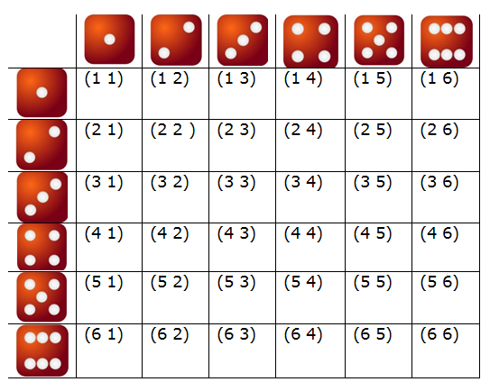
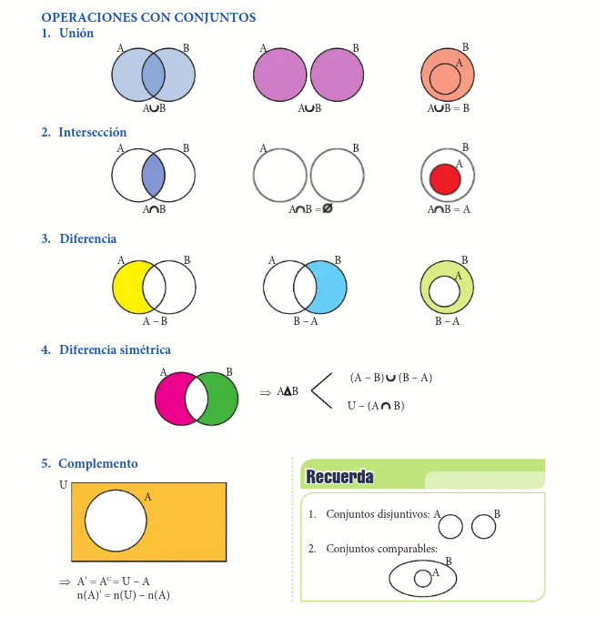
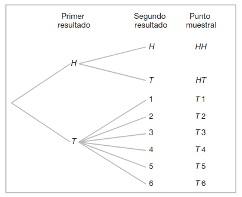

# Clase 03 - Introducción a la Probabilidad

En este capítulo se presentan los conceptos básicos de la teoría de la probabilidad.

---

## 1. Conceptos básicos

* **Experimento**:
  Proceso o acción que produce un resultado bien definido. Puede ser repetible bajo condiciones similares.

* **Experimento simple**:
  Experimento que consta de un solo resultado.

* **Experimento compuesto**:
  Experimento que consta de dos o más experimentos simples.

* **Experimento determinístico**:
  Experimento cuyo resultado puede predecirse con certeza antes de realizarlo.

* **Experimento aleatorio**:
  Experimento cuyo resultado no puede predecirse con certeza antes de realizarlo, aunque se conocen todos los posibles resultados.

* **Evento (o suceso)**:
  Subconjunto del espacio muestral. Es un conjunto de resultados del experimento aleatorio.

* **Eventos mutuamente excluyentes (disjuntos)**:
  Dos eventos ( A ) y ( B ) son mutuamente excluyentes si no pueden ocurrir simultáneamente.
  $$
  A \cap B = \varnothing
  $$

* **Eventos independientes**:
  Dos eventos ( A ) y ( B ) son independientes si la ocurrencia de uno no afecta la probabilidad del otro.
  $$
  P(A \cap B) = P(A)P(B)
  $$

* **Eventos complementarios**:
  El complemento de un evento ( A ), denotado por ( A^c ), contiene todos los resultados que no pertenecen a ( A ).
  $$
  P(A^c) = 1 - P(A)
  $$

* **Diferencia entre eventos mutuamente excluyentes y complementarios**:
  * Los eventos **complementarios** siempre son **mutuamente excluyentes**, ya que $A \cap A^c = \varnothing$. Además, su unión siempre es igual al espacio muestral total ($A \cup A^c = S$).
  * Los eventos **mutuamente excluyentes** no son necesariamente **complementarios**. Dos eventos pueden ser disjuntos sin que su unión cubra la totalidad de los resultados posibles. Por ejemplo, al lanzar un dado, obtener un 1 y obtener un 2 son eventos mutuamente excluyentes, pero no complementarios, ya que su unión no abarca todos los resultados del espacio muestral.

---

## 1.1. Espacios muestrales

* **Espacio muestral finito**:
  Conjunto de todos los posibles resultados cuando su número es limitado.
  Ejemplo: lanzar un dado
  $$
  S = {1,2,3,4,5,6}
  $$

* **Espacio muestral infinito**:
  Conjunto de resultados cuando el número de posibles resultados es infinito.
  Puede ser:

  * Numerable (ej. número de lanzamientos hasta obtener cara).
  * No numerable (ej. intervalo continuo de medición).

### 1.1.1. Ejemplos de espacios muestrales y eventos



*Figura 1: Espacio muestral del lanzamiento de dos dados.*

**Experimento**: Lanzamiento de dos dados de seis caras.

* **Espacio muestral ($S$):**
    Conjunto de todos los pares posibles $(d_1, d_2)$.
    $$S = \{ (1,1), (1,2), \dots, (6,6) \}, \quad |S| = 36$$

* **Evento ($A$):** Obtener una suma igual a 7.
    $$A = \{ (1,6), (2,5), (3,4), (4,3), (5,2), (6,1) \}$$

* **Eventos mutuamente excluyentes:**
    Sea $A$ el evento "la suma es 7" y $B$ el evento "obtener dobles (mismo número en ambos dados)".
    Como no existe ningún par cuya suma sea 7 y sea un doble, $A \cap B = \emptyset$.

* **Eventos independientes:**
    Sea $E_1$ el evento "el primer dado es un 4" y $E_2$ el evento "el segundo dado es un 2".
    El resultado del primer dado no altera la probabilidad del resultado del segundo dado.

* **Eventos complementarios:**
    Sea $C$ el evento "la suma de los dados es par".
    El evento complementario $C^c$ es "la suma de los dados es impar".
    $$P(C) + P(C^c) = 1$$

---

## 1.2. Algunos conceptos de teoría de conjuntos

En esta sección se definen los conceptos de conjuntos, operaciones entre conjuntos y diagramas de Venn.

La teoría de la probabilidad utiliza el lenguaje de la teoría de conjuntos para formalizar sus conceptos. En este marco, el espacio muestral se define como el conjunto universal y los eventos como subconjuntos de este.

| Teoría de Conjuntos                          | Teoría de Probabilidad               |
| :------------------------------------------- | :----------------------------------- |
| Conjunto Universal ($S$)                     | Espacio Muestral                     |
| Elemento ($x \in S$)                         | Resultado elemental / Punto muestral |
| Subconjunto ($A \subseteq S$)                | Evento o Suceso                      |
| Conjunto vacío ($\emptyset$)                 | Evento imposible                     |
| Unión ($A \cup B$)                           | Evento "A o B" (ocurre al menos uno) |
| Intersección ($A \cap B$)                    | Evento "A y B" (ocurren ambos)       |
| Complemento ($A^c$)                          | Evento "No A" (suceso contrario)     |
| Conjuntos disjuntos ($A \cap B = \emptyset$) | Eventos mutuamente excluyentes       |

Un **conjunto** es una colección de elementos.

Sea ( A ) y ( B ) eventos en un espacio muestral ( S ):

* **Complemento**:
  $$
  A^c = \{ x \in S : x \notin A \}
  $$

* **Intersección**:
  Resultados comunes a ambos eventos.
  $$
  A \cap B
  $$

* **Unión**:
  Resultados que pertenecen a al menos uno de los eventos.
  $$
  A \cup B
  $$

* **Diferencia**:
  Elementos que pertenecen a $A$ pero no a $B$.
  $$
  A - B = A \cap B^c
  $$

* **Diferencia simétrica**:
  Elementos que pertenecen a $A$ o $B$, pero no a ambos.
  $$
  A \triangle B = (A - B) \cup (B - A)
  $$

* **Diagrama de Venn**: Representación gráfica de los conjuntos y sus operaciones. En un diagrama de Venn representamos el espacio muestral como un rectángulo y los eventos con círculos trazados dentro del rectángulo.



*Figura 1: Diagrama de operaciones entre conjuntos.* [Operaciones con Conjuntos](https://www.scribd.com/document/602088709/Operaciones-con-Conjuntos)

**Ejemplo en Python:**

```python
A = {1, 2, 3, 4}
B = {3, 4, 5, 6}
S = {1, 2, 3, 4, 5, 6, 7, 8} # Espacio muestral

print(f"Unión (A ∪ B): {A | B}")
print(f"Intersección (A ∩ B): {A & B}")
print(f"Diferencia (A - B): {A - B}")
print(f"Diferencia simétrica (A Δ B): {A ^ B}")
print(f"Complemento (A^c): {S - A}")
```

```plain
Unión (A ∪ B): {1, 2, 3, 4, 5, 6}
Intersección (A ∩ B): {3, 4}
Diferencia (A - B): {1, 2}
Diferencia simétrica (A Δ B): {1, 2, 5, 6}
Complemento (A^c): {5, 6, 7, 8}
```

---

## 2. Técnicas de conteo

Las técnicas de conteo permiten determinar el número de resultados posibles sin necesidad de enumerarlos explícitamente.

---

### 2.1. Principio de multiplicación y Diagramas de árbol

Un **Diagrama de árbol** es una representación gráfica que permite visualizar todos los posibles resultados de un experimento compuesto.

Se basa en el **principio multiplicativo**:
Si un proceso consta de ( $k$ ) etapas, y la etapa ( $i$ ) puede realizarse de ( $n_i$ ) formas, entonces el número total de resultados es:

$$
n_1 \cdot n_2 \cdot \ldots \cdot n_k
$$

#### 2.1.1. Ejemplo de diagrama de árbol

Un experimento consiste en lanzar una moneda y después lanzarla una segunda vez si sale
cara. Si en el primer lanzamiento sale cruz, entonces se lanza un dado una vez. Para listar
los elementos del espacio muestral que proporciona la mayor información construimos
el diagrama de árbol de la Figura 3. Las diversas trayectorias a lo largo de las ramas del
árbol dan los distintos puntos muestrales.



*Figura 3: Diagrama de árbol del lanzamiento de una moneda y un dado.*

---

### 2.2. Permutaciones y Permutación circular

* **Permutaciones (sin repetición)**:
  Número de formas de ordenar $n$ objetos distintos:
  $$n!$$
  *Ejemplo*: ¿De cuántas formas se pueden sentar 5 personas en una fila?
  $$
  5! = 5 \cdot 4 \cdot 3 \cdot 2 \cdot 1 = 120
  $$

* **Permutaciones de $n$ objetos tomados de $r$ en $r$**:
  $$P(n,r) = \frac{n!}{(n-r)!}$$
  *Ejemplo*: ¿De cuántas formas se pueden elegir un presidente y un secretario de un grupo de 10 personas?
  $$
  P(10,2) = \frac{10!}{(10-2)!} = \frac{10!}{8!} = \frac{10 \cdot 9 \cdot 8!}{8!} = 10 \cdot 9 = 90
  $$

* **Permutaciones circulares**:
  Cuando el orden es alrededor de un círculo:
  $$(n-1)!$$
  *Ejemplo*: ¿De cuántas formas se pueden sentar 6 personas alrededor de una mesa circular?
  $$
  (6-1)! = 5! = 5 \cdot 4 \cdot 3 \cdot 2 \cdot 1 = 120
  $$

**Ejemplo en Python:**

```python
import math

n, r = 5, 3
print(f"Permutaciones de {n}: {math.factorial(n)}")
print(f"Permutaciones de {n} tomados de {r}: {math.perm(n, r)}")
print(f"Permutaciones circulares de {n}: {math.factorial(n-1)}")
```

* **Permutaciones con repetición**:
  Número de formas de ordenar $n$ objetos con repetición:
  $$\frac{n!}{n_1! n_2! \ldots n_k!}$$
  
  *Ejemplo*: ¿De cuántas formas se pueden ordenar las letras de la palabra "MISSISSIPPI"? $$\frac{11!}{1! \cdot 4! \cdot 4! \cdot 2!} = 34650$$

**Ejemplo en Python:**

```python
import math
from collections import Counter

word = "MISSISSIPPI"
n = len(word)
counts = Counter(word).values()
denom = 1
for c in counts:
    denom *= math.factorial(c)

print(f"Permutaciones con repetición de '{word}': {math.factorial(n) // denom}")
```

```plain
Permutaciones con repetición de 'MISSISSIPPI': 34650
```

---

### 2.3. Combinaciones

Número de formas de seleccionar $r$ objetos de un total de $n$, sin importar el orden:

$$\binom{n}{r} = \frac{n!}{r!(n-r)!}$$

*Ejemplo*: ¿De cuántas formas se puede elegir un comité de 3 personas de un grupo de 10?
$$
\binom{10}{3} = \frac{10!}{3! \cdot (10-3)!} = \frac{10!}{3! \cdot 7!} = \frac{10 \cdot 9 \cdot 8}{3 \cdot 2 \cdot 1} = 120
$$

**Ejemplo en Python:**

```python
import math

n, r = 10, 3
print(f"Combinaciones de {n} tomados de {r}: {math.comb(n, r)}")
```

---

## 3. Definición de la Probabilidad

---

### 3.1. ¿Qué es la probabilidad?

Medida numérica que cuantifica la posibilidad de ocurrencia de un evento.
Toma valores en el intervalo:

$$
0 \le P(A) \le 1
$$

---

### 3.2. Enfoque clásico de la probabilidad

Aplicable cuando todos los resultados son igualmente probables.

$$
P(A) = \frac{\text{número de casos favorables}}{\text{número total de casos posibles}}
$$

**Ejemplo**: Calcular la probabilidad de obtener un número par al lanzar un dado equilibrado de seis caras.

* **Espacio muestral ($S$):** $\{1, 2, 3, 4, 5, 6\} \implies n(S) = 6$
* **Evento ($A$):** Obtener un número par $\{2, 4, 6\} \implies n(A) = 3$

$$
P(A) = \frac{n(A)}{n(S)} = \frac{3}{6} = 0.5
$$

```python
from functools import filter

S = {1, 2, 3, 4, 5, 6}
A = filter(lambda x: x % 2 == 0, S)

print(f"Probabilidad de obtener un número par al lanzar un dado equilibrado de seis caras: {len(A) / len(S)}")
```

```plain
Probabilidad de obtener un número par al lanzar un dado equilibrado de seis caras: 0.5
```

---

### 3.3. Enfoque frecuentista de la probabilidad

Define la probabilidad como el límite de la frecuencia relativa cuando el número de repeticiones tiende a infinito:

$$
P(A) = \lim_{n \to \infty} \frac{n_A}{n}
$$

donde ( $n_A$ ) es el número de veces que ocurre el evento ( $A$ ).

```python
import random

# Simulación de 100,000 lanzamientos de una moneda equilibrada
n_ensayos = 100_000
exitos = sum(1 for _ in range(n_ensayos) if random.random() < 0.5)

probabilidad_frecuentista = exitos / n_ensayos
print(f"Probabilidad estimada tras {n_ensayos} experimentos: {probabilidad_frecuentista}")
```

```plain
Probabilidad estimada tras 100000 experimentos: 0.49983
```

---

## 4. Probabilidad de un evento

---

### 3.1. Axiomas de la probabilidad (Kolmogorov)

Sea $S$ el espacio muestral:

1. **No negatividad**: La probabilidad de cualquier evento $A$ es siempre mayor o igual a cero.
   $$P(A) \ge 0$$
2. **Certidumbre**: La probabilidad de que ocurra el espacio muestral completo (algún resultado posible) es igual a 1.
   $$P(S) = 1$$
3. **Aditividad**: Si $A_1, A_2, \ldots$ son eventos mutuamente excluyentes (no pueden ocurrir al mismo tiempo), la probabilidad de su unión es la suma de sus probabilidades individuales.
   $$
   P\left( \bigcup_{i=1}^{\infty} A_i \right) = \sum_{i=1}^{\infty} P(A_i)
   $$

---

### 4.2. Reglas aditivas

* **Eventos mutuamente excluyentes**: Si dos eventos no tienen elementos en común, la probabilidad de que ocurra uno u otro es la suma de sus probabilidades.
  $$
  P(A \cup B) = P(A) + P(B)
  $$

* **Regla general de la adición**: Para cualquier par de eventos, la probabilidad de la unión es la suma de sus probabilidades menos la probabilidad de su intersección (para evitar contar dos veces los elementos comunes).
  $$
  P(A \cup B) = P(A) + P(B) - P(A \cap B)
  $$

---

### 4.3. Regla del producto y eventos independientes

Establece que la probabilidad de que ocurran dos eventos simultáneamente es el producto de la probabilidad de uno por la probabilidad condicional del segundo dado el primero.
$$
P(A \cap B) = P(A)P(B|A)
$$

* **Eventos independientes**: Si la ocurrencia de un evento no afecta al otro, la probabilidad conjunta es simplemente el producto de sus probabilidades individuales.
  $$
  P(A \cap B) = P(A)P(B)
  $$

---

### 4.4. Regla de Laplace

En un espacio muestral donde todos los resultados son igualmente probables (equiprobables), la probabilidad de un evento es el cociente entre el número de casos favorables y el número total de casos posibles.
$$
P(A) = \frac{|A|}{|S|}
$$

---

## Referencias

1. Devore, J. L. (2012). *Probabilidad y estadística para ingeniería y ciencias* (7a ed.). Cengage Learning.
2. Walpole, R. E., Myers, R. H., Myers, S. L., & Ye, K. (2012). *Probabilidad y estadística para ingeniería y ciencias* (8a ed.). Pearson.
3. Mendenhall, W., Beaver, R. J., & Beaver, B. M. (2010). *Introducción a la probabilidad y estadística* (13a ed.). Cengage Learning.
4. Bruce, P., Bruce, A., & Gedeck, P. (2020). *Practical Statistics for Data Scientists: 50+ Essential Concepts Using R and Python* (2nd ed.). O’Reilly Media.
