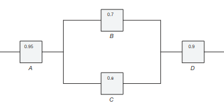

# Ejercicio 12

**2.92** Imagine el diagrama de un sistema eléctrico como el que se muestra en la Figura 2.10. ¿Cuál es la probabilidad de que el sistema funcione? Suponga que los componentes fallan de forma independiente

Figura 2.10: Diagrama para el ejercicio 2.92.

---

Tomado de Walpole, R. E., Myers, R. H., Myers, S. L., & Ye, K. (2012). *Probabilidad y estadística para ingeniería y ciencias* (8a ed.). Pearson Educación.
