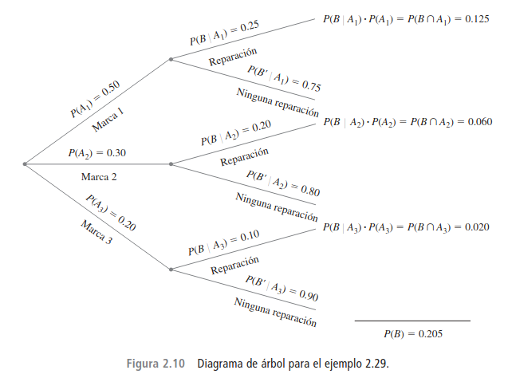
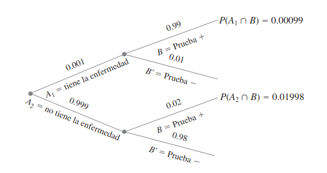

# Clase 05 - Probabilidad condicional y Teorema de Bayes

## 1. Probabilidad condicional

Es la probabilidad de que ocurra un evento $A$, sabiendo que ya ha ocurrido (o se asume que ocurrió) otro evento $B$. Restringe el espacio muestral original a los resultados contenidos en $B$.
$$
P(A|B) = \frac{P(A \cap B)}{P(B)}, \quad P(B) > 0
$$

#### Ejemplo: 

Supóngase que de todos los individuos que compran cierta cámara digital, 60% incluye una tarjeta de memoria opcional en su compra, 40% incluyen una batería extra y 30% incluyen tanto una tarjeta como una batería. Considere seleccionar al azar un comprador y sea $A$ = {tarjeta de memoria adquirida} y $B$ = {batería adquirida}. Entonces $P(A) = 0.60$, $P(B) = 0.40$ y $P(ambas adquiridas) = P(A \cap B) = 0.30$. Dado que el individuo seleccionado adquirió una batería extra, la probabilidad de que una tarjeta opcional también sea adquirida es

$$P(A|B) = \frac{P(A \cap B)}{P(B)} = \frac{0.30}{0.40} = 0.75$$


Es decir, de todos los que adquieren una batería extra, 75% adquirieron una tarjeta de memoria opcional. Asimismo,

$$P(B|A) = \frac{P(A \cap B)}{P(A)} = \frac{0.30}{0.60} = 0.50$$

Obsérvese que $P(A | B) \neq P(A)$ y $P(B | A) \neq P(B)$.

El evento cuya probabilidad se desea podría ser una unión o intersección de otros eventos y lo mismo podría ser cierto del evento condicionante


### 1.1. Regla de la multiplicación para la probabilidad condicional

La definición de probabilidad condicional da el siguiente resultado, obtenido multiplicando ambos miembros de la ecuación por $P(B)$.

$$P(A \cap B) = P(A|B)P(B)$$

Esta regla es importante porque a menudo se desea obtener $P(A \cap B)$, en tanto que $P(B)$ y $P(A | B)$ pueden ser especificadas a partir de la descripción del problema. La consideración de $P(B | A)$ \cdot $P(A \cap B) = P(B | A)P(A)$.

#### Ejemplo:

Una cadena de tiendas de video vende tres marcas diferentes de reproductores de DVD. De sus ventas de reproductores de DVD, 50% son de la marca 1 (la menos cara), 30% son de la marca 2 y 20% son de la marca 3. Cada fabricante ofrece 1 año de garantía en las partes y mano de obra. Se sabe que 25% de los reproductores de DVD de la marca 1 requieren trabajo de reparación dentro del periodo de garantía, mientras que los porcentajes correspondientes de las marcas 2 y 3 son 20% y 10%, respectivamente

1. ¿Cuál es la probabilidad de que un comprador seleccionado al azar haya adquirido un reproductor de DVD marca 1 que necesitará reparación mientras se encuentra dentro de garantía?
2. ¿Cuál es la probabilidad de que un comprador seleccionado al azar haya comprado un reproductor de DVD que necesitará reparación mientras se encuentra dentro de garantía.
3. Si un cliente regresa a la tienda con un reproductor de DVD que necesita reparación dentro de garantía, ¿cuál es la probabilidad de que sea un reproductor de DVD marca 1? ¿Un reproductor de DVD marca 2? ¿Un reproductor de DVD marca 3

##### Etapa 1:

La primera etapa del problema implica un cliente que selecciona una de las tres marcas de reproductor de DVD. Sea $A_i$ = {marca $i$ adquirida}, con $i = 1, 2$ y 3. Entonces $P(A_1) = 0.50$, $P(A_2) = 0.30$ y $P(A_3) = 0.20$. Una vez que se selecciona una marca de reproductor de DVD, la segunda etapa implica observar si el reproductor de DVD seleccionado necesita reparación dentro de garantía. Con $B$ = {necesita reparación} y $B^c$ = {no necesita reparación}, la información dada implica que $P(B | A_1) = 0.25$, $P(B | A_2) = 0.20$ y $P(B | A_3) = 0.10$.


##### Etapa 2:



- Las ramas iniciales corresponden a marcas diferentes de reproductores de DVD;
- hay dos ramas de segunda generación que emanan de la punta de cada rama inicial, una para “necesita reparación” y la otra para “no necesita reparación”. 
- La probabilidad de que $P(A_i)$ aparezca en la rama i-ésima inicial, en tanto que las probabilidades condicionales $P(B | A_i)$ y $P(B^c | A_i)$ aparecen en las ramas de segunda generación. 
- A la derecha de cada rama de segunda generación correspondiente a la ocurrencia de $B$, se muestra el producto de probabilidades en las ramas que conducen hacia fuera de dicho punto. Ésta es simplemente la regla de multiplicación en acción. La respuesta a la pregunta planteada en 1 es por lo tanto $P(A_1 \cap B) = P(B|A_1)P(A_1) = 0.125$. La respuesta a la pregunta 2 es

$$

P(B) = P[(marca 1 y reparación) o (marca 2 y reparación) o (marca 3 y reparación)] \\

P(B) = P(A1 \cap B) + P(A2 \cap B) + P(A3 \cap B) \\

P(B) = 0.125 + 0.060 + 0.020 \\

P(B) = 0.205
$$


Y finalmente,

$$
P(A_1|B) = \frac{P(A_1 \cap B)}{P(B)} = \frac{0.125}{0.205} \approx 0.610
$$

$$
P(A_2|B) = \frac{P(A_2 \cap B)}{P(B)} = \frac{0.060}{0.205} \approx 0.293
$$

$$
P(A_3|B) = \frac{P(A_3 \cap B)}{P(B)} = \frac{0.020}{0.205} \approx 0.098
$$

##### Etapa 3:

La probabilidad previa o inicial de la marca 1 es 0.50. Una vez que se sabe que el reproductor de DVD seleccionado necesitaba reparación, la probabilidad posterior de la marca 1 se incrementa a 0.61. Esto se debe a que es más probable que los reproductores de DVD marca 1 necesiten reparación de garantía que las demás marcas. La probabilidad posterior de la marca 3 es $P(A_3 | B) = 0.10$, la cual es mucho menor que la probabilidad previa $P(A_3) = 0.20$


---

## 2. Regla de Bayes

Permite calcular la probabilidad de una causa (evento $A_i$) dado un efecto observado (evento $B$), basándose en el conocimiento previo de las probabilidades de las causas y las probabilidades del efecto dada cada causa.
Sea $A_1, A_2, \ldots, A_n$ una partición del espacio muestral:
$$
P(A_i|B) = \frac{P(B|A_i)P(A_i)}{\sum_{j=1}^{n} P(B|A_j)P(A_j)}
$$


#### Ejemplo: Diagnóstico de una enfermedad rara

Supongamos que el 0.1% de los adultos padece una enfermedad rara ($A_1$). Se ha desarrollado una prueba de diagnóstico tal que:

* Si un individuo tiene la enfermedad, la prueba es positiva ($B$) el 99% de las veces ($P(B|A_1) = 0.99$).
* Si un individuo no tiene la enfermedad ($A_2$), la prueba es positiva el 2% de las veces ($P(B|A_2) = 0.02$).

Si un individuo seleccionado al azar da positivo, ¿cuál es la probabilidad de que realmente tenga la enfermedad?



$$
P(A_1|B) = \frac{P(B|A_1)P(A_1)}{P(B|A_1)P(A_1) + P(B|A_2)P(A_2)}
$$

$$
P(A_1|B) = \frac{(0.99)(0.001)}{(0.99)(0.001) + (0.02)(0.999)} = \frac{0.00099}{0.00099 + 0.01998} \approx 0.0472
$$

```python
# Probabilidades a priori
p_a1 = 0.001  # Tiene la enfermedad
p_a2 = 1 - p_a1  # No tiene la enfermedad

# Probabilidades condicionales (verosimilitud)
p_b_dado_a1 = 0.99  # Positivo dado que tiene la enfermedad
p_b_dado_a2 = 0.02  # Positivo dado que no tiene la enfermedad (falso positivo)

# Teorema de Bayes
p_a1_dado_b = (p_b_dado_a1 * p_a1) / (p_b_dado_a1 * p_a1 + p_b_dado_a2 * p_a2)

print(f"La probabilidad de tener la enfermedad dado un resultado positivo es: {p_a1_dado_b:.4f}")
```

```plain
La probabilidad de tener la enfermedad dado un resultado positivo es: 0.0472
```

Este resultado parece contraintuitivo; la prueba de diagnóstico parece tan precisa que es altamente probable que alguien con un resultado positivo de prueba tenga la enfermedad, mientras que la probabilidad condicional calculada es de sólo `0.0472`. Sin embargo, como la enfermedad es rara y la prueba es sólo moderadamente confiable, surgen más resultados positivos falsos que positivos verdaderos.

---

## 3. Aplicación del Teorema de Bayes: el clasificador Naive-Bayes

### 3.1 ¿Qué es un clasificador?

Un **clasificador** es un algoritmo de aprendizaje automático (machine learning) que asigna automáticamente una categoría o etiqueta a un elemento dado, basándose en sus características. En términos simples:

- **Entrada**: datos con características observables (atributos)
- **Proceso**: análisis de patrones aprendidos
- **Salida**: una clase o categoría predicha

**Ejemplos de aplicación**:
- Clasificar correos electrónicos como *spam* o *no spam*
- Diagnosticar si un paciente tiene una enfermedad basándose en síntomas
- Identificar si una transacción bancaria es fraudulenta
- Reconocer el sentimiento de un texto (positivo/negativo)

### 3.2 Proceso de entrenamiento y predicción

Los clasificadores funcionan en dos etapas fundamentales:

#### **Entrenamiento (Training)**
El algoritmo aprende patrones a partir de un **conjunto de datos etiquetado** (datos históricos donde ya se conoce la respuesta correcta).
- Analiza las características de cada ejemplo
- Establece relaciones entre características y clases
- Construye un **modelo** que captura estos patrones

#### **Predicción (Prediction/Inference)**
Una vez entrenado, el modelo puede:
- Recibir nuevos datos sin etiquetar
- Aplicar las reglas aprendidas
- Predecir la clase más probable para cada nuevo ejemplo

```plain
Datos de Entrenamiento → [Entrenamiento] → Modelo
                                        ↓
Nuevos Datos → [Predicción] → Clasificación
```

### 3.3 ¿Qué es el Clasificador Naive Bayes?

El **clasificador Naive Bayes** es un algoritmo probabilístico basado en el **Teorema de Bayes** que hace una suposición "ingenua" (*naive*): **asume que todas las características son independientes entre sí**.

#### Fórmula:

$$P(C_k | \vec{x}) = \frac{P(C_k) \cdot P(\vec{x} | C_k)}{P(\vec{x})}$$

Donde:
- $C_k$: clase $k$-ésima (ej. spam, no spam)
- $\vec{x} = (x_1, x_2, ..., x_n)$: vector de características
- $P(C_k)$: probabilidad **a priori** de la clase
- $P(\vec{x} | C_k)$: **verosimilitud** (probabilidad de las características dada la clase)

#### La suposición "Naive" (Ingenua):

Al asumir independencia entre características:

$$P(\vec{x} | C_k) = P(x_1 | C_k) \cdot P(x_2 | C_k) \cdot ... \cdot P(x_n | C_k) = \prod_{i=1}^{n} P(x_i | C_k)$$

Esto **simplifica enormemente los cálculos**, aunque en la práctica las características raramente son completamente independientes. Sorprendentemente, **funciona muy bien** en muchos problemas reales.

#### Características principales:

| Ventajas                                        | Desventajas                                                    |
| ----------------------------------------------- | -------------------------------------------------------------- |
| Rápido de entrenar y predecir                   | La suposición de independencia rara vez es cierta              |
| Funciona bien con datos de alta dimensionalidad | No captura relaciones entre características                    |
| Eficiente con conjuntos de datos grandes        | Problemas si una característica no aparece en el entrenamiento |
| Buen rendimiento en clasificación de texto      |                                                                |

### 3.4 Ejemplo práctico: Clasificación de correos Spam

#### Descripción del problema

Queremos clasificar correos electrónicos como **spam** o **no spam** basándonos en la frecuencia de ciertas palabras.

#### Implementación en Python

```python
import pandas as pd
from sklearn.model_selection import train_test_split
from sklearn.naive_bayes import MultinomialNB
from sklearn.feature_extraction.text import CountVectorizer
from sklearn.metrics import accuracy_score, classification_report

# 1. Cargar datos
# Dataset: emails.csv con columnas 'text' y 'spam' (1=spam, 0=no spam)
df = pd.read_csv('emails.csv.zip', compression='zip')

# 2. Preparar datos
X = df['text']  # Texto del correo
y = df['spam']  # Etiqueta: 1=spam, 0=no spam

# 3. Dividir en entrenamiento (80%) y prueba (20%)
X_train, X_test, y_train, y_test = train_test_split(
    X, y, test_size=0.2, random_state=42
)

# 4. Convertir texto a matriz de características (Bag of Words)
# Cada palabra es una característica, el valor es la frecuencia
vectorizer = CountVectorizer(stop_words='english')
X_train_vec = vectorizer.fit_transform(X_train)
X_test_vec = vectorizer.transform(X_test)

# 5. Crear y entrenar el clasificador Naive Bayes
# MultinomialNB es ideal para características discretas (conteos)
clf = MultinomialNB()
clf.fit(X_train_vec, y_train)  # Fase de ENTRENAMIENTO

# 6. Realizar predicciones
y_pred = clf.predict(X_test_vec)  # Fase de PREDICCIÓN

# 7. Evaluar el modelo
print(f"Precisión: {accuracy_score(y_test, y_pred):.4f}")
print("\nReporte de clasificación:")
print(classification_report(y_test, y_pred, target_names=['No Spam', 'Spam']))

# 8. Ejemplo de predicción con un nuevo correo
nuevo_correo = ["Congratulations! You won a million dollars! Click here!"]
nuevo_vec = vectorizer.transform(nuevo_correo)
prediccion = clf.predict(nuevo_vec)
probabilidad = clf.predict_proba(nuevo_vec)

print(f"\nNuevo correo: {nuevo_correo[0]}")
print(f"Predicción: {'Spam' if prediccion[0] == 1 else 'No Spam'}")
print(f"Probabilidades: No Spam={probabilidad[0][0]:.4f}, Spam={probabilidad[0][1]:.4f}")
```

#### Explicación paso a paso:

1. **Carga de datos**: El dataset contiene correos etiquetados manualmente
2. **División**: Separamos datos de entrenamiento (para aprender) y prueba (para evaluar)
3. **Vectorización**: Convertimos texto a números (frecuencia de palabras)
4. **Entrenamiento**: El modelo calcula:
   - $P(\text{spam})$: proporción de correos spam
   - $P(\text{palabra} | \text{spam})$: frecuencia de cada palabra en spam
5. **Predicción**: Para un nuevo correo, calcula la probabilidad de que sea spam usando el Teorema de Bayes

#### Resultado típico:

```
Precisión: 0.9847

Reporte de clasificación:
              precision    recall  f1-score   support

    No Spam       0.99      0.99      0.99      1000
       Spam       0.97      0.97      0.97       300

Nuevo correo: Congratulations! You won a million dollars! Click here!
Predicción: Spam
Probabilidades: No Spam=0.0012, Spam=0.9988
```

> **Nota**: El código completo está disponible en el directorio `codes/naive_bayes_example.py` junto con el dataset `emails.csv.zip`.


## Referencias

1. Devore, J. L. (2012). *Probabilidad y estadística para ingeniería y ciencias* (7a ed.). Cengage Learning.
2. Walpole, R. E., Myers, R. H., Myers, S. L., & Ye, K. (2012). *Probabilidad y estadística para ingeniería y ciencias* (8a ed.). Pearson.
3. Mendenhall, W., Beaver, R. J., & Beaver, B. M. (2010). *Introducción a la probabilidad y estadística* (13a ed.). Cengage Learning.
4. Bruce, P., Bruce, A., & Gedeck, P. (2020). *Practical Statistics for Data Scientists: 50+ Essential Concepts Using R and Python* (2nd ed.). O’Reilly Media.
