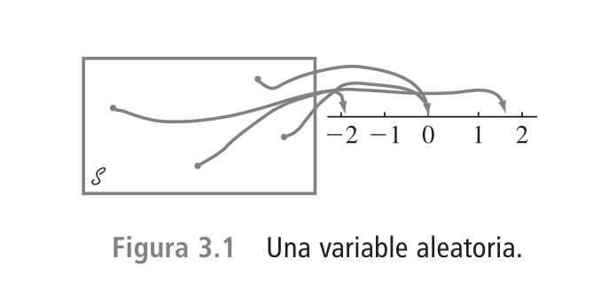
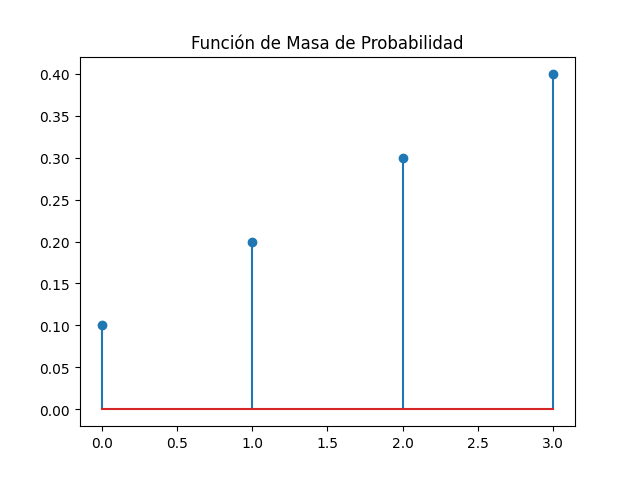
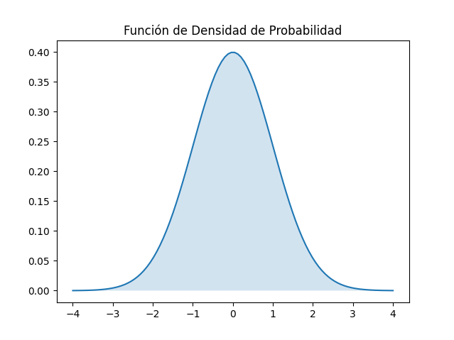
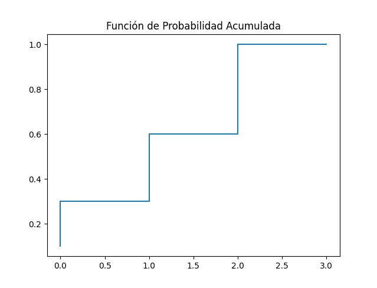
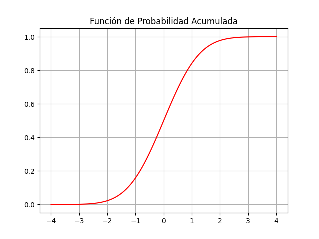

# Clase 05: Introducción a las distribuciones de probabilidad

En esta sesión exploraremos uno de los pilares fundamentales de la estadística descriptiva e inferencial: las **Distribuciones de Probabilidad**.

Una distribución de probabilidad es, en esencia, un **modelo matemático** que describe cómo se espera que varíen los resultados de un experimento aleatorio. Es la herramienta que nos permite cuantificar la incertidumbre.

---

## 1. Variable Aleatoria

En cualquier experimento, existen numerosas características que pueden ser observadas o medidas, pero en la mayoría de los casos un experimentador se enfoca en algún aspecto específico o aspectos de una muestra. Ejemplos:

- En un estudio de patrones de viaje entre los suburbios y la ciudad en un área metropolitana, a cada individuo en una muestra se le podría preguntar sobre la distancia que recorre para ir de su casa al trabajo y viceversa y el número de personas que lo hacen en el mismo vehículo, pero no sobre su coeficiente inte lectual, ingreso, tamaño de su familia y otras características.
- Un investigador puede probar una muestra de componentes y anotar sólo el número de los que han fallado dentro de 1000 horas, en lugar de anotar los tiempos de falla individuales.

En general, cada resultado de un experimento puede ser asociado con un número especificando una regla de asociación. Semejante regla de asociación se llama **variable aleatoria**, variable porque diferentes valores numéricos son posibles y aleatoria porque el valor observado depende de cuál de los posibles resultados experimentales resulte



Una **Variable Aleatoria (V.A.)** es una función que asigna un valor numérico a cada resultado posible de un experimento aleatorio. Formalmente, si $S$ es el espacio muestral, una V.A. $X$ es una función.

**Notación:** Se acostumbra denotar las variables aleatorias con letras mayúsculas, tales como $X$ y $Y$, que son las de cerca del final del alfabeto. En contraste al uso previo de una letra minúscula, tal como $x$, para denotar una variable, ahora se utilizarán letras mayúsculas para representar algún valor particular de la variable aleatoria correspondiente.

$$X: S \to \mathbb{R}$$

Las variables aleatorias se clasifican de acuerdo a los valores que pueden tomar. En este capítulo, se clasifican en dos tipos:

1. **Variable Discreta Aleatoria**
2. **Variable Continua Aleatoria**

Las variables aleatorias permiten expresar las distribuciones de probabilidad a través de funciones matemáticas. Por ejemplo, si $X$ es una variable aleatoria discreta, su distribución de probabilidad se puede expresar a través de la función de masa de probabilidad $P(X=x)$, y si $X$ es una variable aleatoria continua, su distribución de probabilidad se puede expresar a través de la función de densidad de probabilidad $f(x)$.

Cuando no se tiene una fórmula matemática para la distribución de probabilidad, se puede expresar a través de una tabla de distribución de probabilidad. Por ejemplo, si $X$ es una variable aleatoria discreta, su distribución de probabilidad se puede expresar a través de una tabla de distribución de probabilidad. Ejemplo:

| $x$ | $P(X=x)$ |
|-----|----------|
| 0   | 0.1      |
| 1   | 0.2      |
| 2   | 0.3      |
| 3   | 0.4      |

### 1.1. Variable Discreta Aleatoria

Una **variable aleatoria discreta** es aquella que puede tomar un número finito o infinito numerable de valores. Generalmente surge de procesos de **conteo**.

**Ejemplo Conceptual:** El número de caras obtenidas al lanzar una moneda 3 veces. Los valores posibles son $\{0, 1, 2, 3\}$.

**Ejemplo de Código (Python):**

```python
import numpy as np
import matplotlib.pyplot as plt
from scipy.stats import binom

# Definimos parámetros: n=intentos, p=probabilidad de éxito
n, p = 3, 0.5
x = np.arange(0, n+1)
probabilidades = binom.pmf(x, n, p)

print(f"Valores posibles: {x}")
print(f"Probabilidades: {probabilidades}")
```

```plain
Valores posibles: [0 1 2 3]
Probabilidades: [0.125 0.375 0.375 0.125]
```

### 1.2. Variable Continua Aleatoria

Es aquella que puede tomar cualquier valor en un intervalo de números reales. Generalmente surge de procesos de **medición**. Una variable aleatoria es continua si ambas de las siguientes condiciones aplican:

1. El conjunto de valores posibles es un intervalo de números reales (posiblemente de extensión infinita, es decir, desde $-\infty$ hasta $\infty$).
2. Para cualquier valor $x$ en el intervalo, la probabilidad de que la variable aleatoria tome el valor $x$ es cero. esto es, $P(X = c) = 0$ con cualquier valor posible de $c$.

**Ejemplo Conceptual:** El tiempo que tarda un estudiante en completar un examen. El tiempo puede ser 45.5 minutos, 45.5002 minutos, etc.

**Ejemplo de Código (Python):**

```python
from scipy.stats import norm

# Definimos una distribución normal (media=0, desviación=1)
mu, sigma = 0, 1
# Calculamos la probabilidad de que X esté entre -1 y 1
prob_intervalo = norm.cdf(1, mu, sigma) - norm.cdf(-1, mu, sigma)

print(f"Probabilidad P(-1 < X < 1): {prob_intervalo:.4f}")
```

```plain
Probabilidad P(-1 < X < 1): 0.6827
```

---

## 2. Función de densidad de probabilidad

Para variables discretas usamos la **Función de Masa de Probabilidad (PMF)**, y para continuas la **Función de Densidad de Probabilidad (PDF)**. Ambas denotan la "concentración" de probabilidad en un punto o vecindad.

Para una V.A. discreta $X$, la **PMF** $P(X=x)$ debe cumplir:

1. $P(X=x) \geq 0$ para todo $x$.
2. $\sum_{x} P(X=x) = 1$

**Ejemplo de Código, Grraficando una PMF:**

| $x$ | $P(X=x)$ |
|-----|----------|
| 0   | 0.1      |
| 1   | 0.2      |
| 2   | 0.3      |
| 3   | 0.4      |

```python
import numpy as np
import matplotlib.pyplot as plt

# Definimos parámetros: n=intentos, p=probabilidad de éxito
x = np.array([0, 1, 2, 3])
probabilidades = np.array([0.1, 0.2, 0.3, 0.4])

print(f"Valores posibles: {x}")
print(f"Probabilidades: {probabilidades}")

plt.stem(x, probabilidades)
plt.title("Función de Masa de Probabilidad")
plt.show()
```



Para una V.A. continua $X$, la **PDF** $f(x)$ debe cumplir:

1. $f(x) \geq 0$ para todo $x$.
2. El área total bajo la curva es 1:
3. $P(a \leq X \leq b) = \int_{a}^{b} f(x) \, dx$

$$ \int_{-\infty}^{\infty} f(x) \, dx = 1 $$

**Ejemplo de Código (Graficando una PDF):**

```python
x = np.linspace(-4, 4, 100)
pdf = norm.pdf(x, 0, 1)

plt.plot(x, pdf, label='Normal Standard PDF')
plt.fill_between(x, pdf, alpha=0.2)
plt.title("Función de Densidad de Probabilidad")
plt.show()
```



---

## 3. Función de probabilidad acumulada

La **Función de Distribución Acumulada (CDF)**, denotada por $F(x)$, representa la probabilidad de que la variable aleatoria tome un valor menor o igual a $x$.

$$ F(x) = P(X \leq x) $$

Para **variables discretas**, la **CDF** es una función escalonada, y se define como:

$$ F(x) = \sum_{t \leq x} P(X=t) $$

**Ejemplo de Código:**

```python
import numpy as np
import matplotlib.pyplot as plt

# Definimos parámetros: n=intentos, p=probabilidad de éxito
x = np.array([0, 1, 2, 3])
probabilidades = np.array([0.1, 0.2, 0.3, 0.4])
CDF = np.cumsum(probabilidades)

# Se grafica la funcion de probabilidad acumulada como una funcion escalonada
plt.step(x, CDF, label="CDF")
plt.title("Función de Probabilidad Acumulada")
plt.grid(True)
plt.show()
```



Para **variables continuas**, la **CDF** equivale a la integral de la densidad:

$$ F(x) = \int_{-\infty}^{x} f(t) \, dt $$

**Ejemplo de Código:**

```python
# CDF de una distribución normal
cdf_values = norm.cdf(x, 0, 1)

plt.plot(x, cdf_values, color='red', label='Normal Standard CDF')
plt.title("Función de Probabilidad Acumulada")
plt.grid(True)
plt.show()
```



---

## 4. Transformaciones de variables aleatorias

A menudo nos interesa el comportamiento de una nueva variable $Y$ que es función de $X$ (ej. $Y = g(X)$).

Si tenemos una transformación lineal $Y = aX + b$, las propiedades son directas, pero si $g(X)$ es no-lineal, requerimos métodos como el del "Jacobiano" o de la "Función Inversa" para hallar la nueva densidad.

**Ejemplo Conceptual:** Si $X$ es la temperatura en Celsius, $Y = 1.8X + 32$ es la temperatura en Fahrenheit.

---

## 5. Valor esperado y varianza

Son las medidas de tendencia central y dispersión que caracterizan a una distribución.

### 5.1. Valor Esperado

Representa el "promedio" a largo plazo si el experimento se repitiera infinitas veces. Se denota como $E[X]$ o $\mu$.

Para el caso continuo:
$$ E[X] = \int_{-\infty}^{\infty} x \cdot f(x) \, dx $$

**Ejemplo de Código:**

```python
from scipy.stats import norm

esperanza = norm.expect(lambda x: x ** 2 + 2 * x + 3, loc=0, scale=1)
print(f"Valor Esperado (Media): {esperanza:.4f}")
```

```plain
Valor Esperado (Media): 4.0000
```

**Ejemplo de Código:**

```python
import numpy as np

x = np.array([0, 1, 2, 3])
probabilidades = np.array([0.1, 0.2, 0.3, 0.4])

# funcion de valor esperado
func = lambda x: x ** 2

valor_esperado = np.sum(x * probabilidades)
print(f"Valor Esperado (Media): {valor_esperado}")

variaza_esperada = np.sum((x - valor_esperado) ** 2 * probabilidades)
print(f"Varianza Esperada: {variaza_esperada}")

valor_esperado_func = np.sum(func(x) * probabilidades)
print(f"Valor Esperado (Media): {valor_esperado_func}")
```

```plain
Valor Esperado (Media): 2.0
Varianza Esperada: 1.0
Valor Esperado (Media): 5.0
```

### 5.2. Varianza

Mide qué tan alejados están los valores del valor esperado. Se denota como $Var(X)$ o $\sigma^2$.

$$ Var(X) = E[(X - \mu)^2] = E[X^2] - (E[X])^2 $$

**Ejemplo de Código:**

```python
varianza = norm.var(loc=0, scale=1)
print(f"Varianza: {varianza}")
```

### 5.3. Caso general: Momentos y función generatriz de momentos

Los **Momentos** son generalizaciones de la media y la varianza. El $k$-ésimo momento ordinario se define como:

$$ \mu'_k = E[X^k] $$

La **Función Generatriz de Momentos (MGF)** es una herramienta poderosa que "almacena" todos los momentos de una distribución:

$$ M_X(t) = E[e^{tX}] $$

Si derivamos $M_X(t)$ respecto a $t$ y evaluamos en $t=0$, obtenemos los momentos de la variable.

---

## 6. Teorema de Chebyshev

El matemático ruso **P. L. Chebyshev** (1821-1894) descubrió que la fracción del área bajo cualquier distribución de probabilidad que se encuentra entre cualesquiera dos valores simétricos alrededor de la media está íntimamente relacionada con la desviación estándar.

El **Teorema de Chebyshev** ofrece una cota inferior para la probabilidad de que una variable aleatoria $X$ caiga dentro de $k$ desviaciones estándar de su media $\mu$. Lo más potente de este teorema es que es válido para **cualquier** distribución de probabilidad, ya sea discreta o continua, simétrica o sesgada.

### 6.1. Definición Formal

Para cualquier variable aleatoria $X$ con media $\mu$ y desviación estándar $\sigma$, y para cualquier número real $k > 1$:

$$P(\mu - k\sigma < X < \mu + k\sigma) \geq 1 - \frac{1}{k^2}$$

O en términos de valor absoluto (la probabilidad de que la variable esté "lejos" de la media):

$$P(|X - \mu| \geq k\sigma) \leq \frac{1}{k^2}$$

### 6.2. Interpretaciones Clave

| Desviaciones ($k$) | Probabilidad Mínima ($1 - 1/k^2$) | Significado |
| :---: | :---: | :--- |
| $k=2$ | $0.75$ ($75\%$) | Al menos $3/4$ de los datos están en el intervalo $\mu \pm 2\sigma$. |
| $k=3$ | $0.888...$ ($88.9\%$) | Al menos $8/9$ de los datos están en el intervalo $\mu \pm 3\sigma$. |
| $k=4$ | $0.9375$ ($93.8\%$) | Al menos $15/16$ de los datos están en el intervalo $\mu \pm 4\sigma$. |

> [!IMPORTANT]
> El teorema de Chebyshev se conoce como un resultado de **distribución libre**. Es especialmente útil cuando se desconoce la forma de la distribución, aunque sus límites suelen ser conservadores. Si conocemos la distribución (ej. Normal), podemos obtener probabilidades mucho más precisas.

---

### Ejemplo 4.27

Supongamos una variable aleatoria $X$ con media $\mu = 8$ y varianza $\sigma^2 = 9$ (por ende, $\sigma = 3$). No conocemos el tipo de distribución.

**a) Hallar la probabilidad de que $X$ caiga entre $-4$ y $20$**

1. Definimos los límites del intervalo en términos de $k\sigma$:
   - Inferior: $\mu - k\sigma = -4 \implies 8 - k(3) = -4 \implies 3k = 12 \implies k = 4$
   - Superior: $\mu + k\sigma = 20 \implies 8 + k(3) = 20 \implies 3k = 12 \implies k = 4$
2. Aplicamos la fórmula:
   $$P(-4 < X < 20) \geq 1 - \frac{1}{4^2} = 1 - \frac{1}{16} = \frac{15}{16} \approx 0.9375$$
   Hay una probabilidad de **al menos 93.75%** de que $X$ esté en este rango.

**b) Hallar $P(|X - 8| \geq 6)$**

1. Notamos que $6$ representa la distancia máxima desde la media $\mu=8$:
   - $k\sigma = 6 \implies k(3) = 6 \implies k = 2$
2. Aplicamos la forma complementaria del teorema:
   $$P(|X - 8| \geq 6) \leq \frac{1}{2^2} = \frac{1}{4} = 0.25$$
   La probabilidad de que $X$ se aleje más de $6$ unidades de la media es **como máximo de 25%**.

---

### 6.3. Verificación con Código (Python)

Podemos comparar el límite de Chebyshev con una distribución específica para ver qué tan "conservador" es:

```python
import numpy as np
from scipy.stats import norm

# Parámetros del problema
mu, sigma = 8, 3
k = 2  # Buscamos el intervalo mu +/- 2*sigma (de 2 a 14)

# 1. Cota de Chebyshev
chebyshev_limit = 1 - 1/k**2

# 2. Probabilidad Real si la distribución fuera Normal
prob_normal = norm.cdf(mu + k*sigma, mu, sigma) - norm.cdf(mu - k*sigma, mu, sigma)

print(f"Cota de Chebyshev (k=2): {chebyshev_limit:.4f} (Mínimo 75%)")
print(f"Probabilidad Exacta (Si fuera Normal): {prob_normal:.4f} (Aprox 95.4%)")
```
