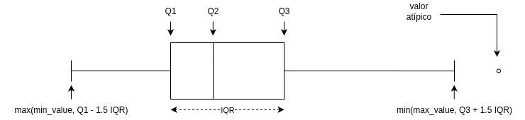

# Universidad Sergio Arboleda

## Examen Parcial 1 - Estadística y Probabilidad

---

Fecha: Viernes 13 de Marzo de 2026

Nombres y Apellidos: _____________________________________________________________________________

---

### Pregunta 1 (5 puntos)

Categoriza las siguientes variables como cualitativas y cuantitativas:

- Edad.
- País de nacimiento.
- Color favorito.
- Tiempo para responder una pregunta.

### Pregunta 2 (5 puntos)

Identifique la población estadística, la muestra y la variable de interés en cada una de las siguientes situaciones:

1. Para aprender acerca de los salarios iniciales para los ingenieros que se gradúan de una universidad del medio oeste, se pide a 20 ex alumnos de que informen su salario inicial luego de graduarse.
2. Quince chips de memoria para computadora se seleccionan de las mil fabricadas ese día. Se prueban los chips de memoria para computadora y cinco resultan defectuosos.
3. Se midió la resistencia a la tensión en 20 especímenes fabricados con un nuevo material plástico. La intención es aprender acerca de las resistencias a la tensión para todos los especímenes que pudieran fabricarse con el nuevo material plástico.

### Pregunta 3 (10 puntos)

Completa los valores faltantes en la siguiente tabla de distribución de frecuencias. 

<!--
| Intervalo | Frecuencia absoluta | Frecuencia relativa | Frecuencia acumulada | Frecuencia relativa acumulada |
|-----------|---------------------|---------------------|----------------------|-------------------------------|
| \[20-24\) | 10                  |                     |                      |                               |
| \[24-28\) | 17                  |                     |                      |                               |
| \[28-32\) | 23                  |                     |                      |                               |
| \[32-36\) | 35                  |                     |                      |                               |
| \[36-40\) | 45                  |                     |                      |                               |
| \[40-44\) | 30                  |                     |                      |                               |
| \[44-48\) | 29                  |                     |                      |                               |
| \[48-52\) | 21                  |                     |                      |                               |
| \[52-56\) | 24                  |                     |                      |                               |
| \[56-60\) | 9                   |                     |                      |                               |
-->

| Intervalo | Frecuencia absoluta | Frecuencia relativa | Frecuencia acumulada | Frecuencia relativa acumulada |
| --------- | ------------------- | ------------------- | -------------------- | ----------------------------- |
| [20–28)   | 27                  |                     |                      |                               |
| [28–36)   | 58                  |                     |                      |                               |
| [36–44)   | 75                  |                     |                      |                               |
| [44–52)   | 50                  |                     |                      |                               |
| [52–60)   | 33                  |                     |                      |                               |

---

### Pregunta 4 (25 puntos)

**80**. Las distancias de recorrido de rutas de autobuses de cualquier sistema de tránsito particular por lo general varían de una ruta a otra. El artículo (“Planning of City Bus Routes”, J. of the Institution of Engineers, 1995: 211-215) da la siguiente información sobre las distancias (km) de un sistema particular. Note que no todos los intervalos tienen el mismo ancho.

| Distancia  | [6–8) | [8–10) | [10–12) | [12–14) | [14–16) | [16–18) | [18–20) | [20–22) |
| ---------- | ----- | ------ | ------- | ------- | ------- | ------- | ------- | ------- |
| Frecuencia | 6     | 23     | 30      | 35      | 32      | 48      | 42      | 40      |

| Distancia  | [22–24) | [24–26) | [26–28) | [28–30) | [30–35) | [35–40) | [40–45) |
| ---------- | ------- | ------- | ------- | ------- | ------- | ------- | ------- |
| Frecuencia | 28      | 27      | 26      | 14      | 27      | 11      | 2       |

1. Trace un histograma correspondiente a estas frecuencias.
2. ¿Qué proporción de estas distancias de ruta son menore que 20? ¿Qué proporción de estas rutas tienen distancias de recorrido de por lo menos 30?
3. ¿Aproximadamente cuál es el valor de 90° percentil de la distribución de distancia de recorrido de las rutas?
4. ¿Aproximadamente cuál es la distancia de recorrido de ruta mediana?

### Pregunta 5 (30 puntos)

**2.44-2.45** Una compañía experimenta un problema crónico de soldadura defectuosa con un ensamble de tubo de desagüe. Cada ensamble fabricado se prueba contra fugas en un tanque de agua. Se recopilaron datos sobre la brecha entre la brida y la tubería, para 6 ensambles defectuosos que tenían fuga y 6 ensambles buenos que aprobaron la prueba contra fugas.

```plain
Con fuga:   0.290   0.104   0.207   0.145   0.104   0.124
Buenos:     0.207   0.124   0.062   0.301   0.186   0.124
```

1. Calcular la media muestral de los ensambles con fuga.
2. Calcular la desviación estándar muestral de los ensambles con fuga.
3. Calcular la media muestral de los ensambles que no tenían fuga.
4. Calcular la desviación estándar muestral de los ensambles que no tenían fuga.
5. ¿Parece haber una diferencia sustancial en la brecha entre los ensambles que tenían fuga y aquellos que no la tenían? El grupo de mejoramiento de la calidad dirigió su atención a las variables en el proceso de soldadura.

### Pregunta 6 (25 puntos)

Las propiedades mecánicas permisibles para el diseño estructural de vehículos aeroespaciales metálicos requieren un método aprobado para analizar estadísticamente datos de prueba empíricos. El artículo (*“Establishing Mechanical Property Allowables for Metals”*, J. of Testing and Evaluation, 1998: 293-299) utilizó los datos anexos sobre resistencia a la tensión última (*lb/pulg2*) como base para abordar las dificultades que se presentan en el desarrollo de dicho método. La siguiente es una descripción dada por MINITAB de los datos de resistencia dados.

|                      | N   | Media  | Mediana | Media Recortada | Desviación estándar | Media SE | Mínimo | Máximo | Q1     |     Q3 |
|----------------------|-----|--------|---------|-----------------|---------------------|----------|--------|--------|--------|--------|
| Resistencia Variable | 153 | 135.39 | 135.40  | 135.41          | 4.59                | 0.37     | 122.20 | 147.70 | 132.95 | 138.25 |

1. Comente sobre cualesquiera características interesantes (los cuartiles y los cuartos son virtualmente idénticos en este caso).
2. Tomando como referencia la siguiente imagen, construya una gráfica de caja de los datos basada en los
cuartiles y comente sobre lo que ve.

<!--  -->

