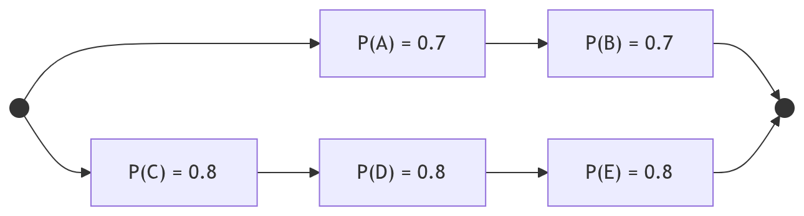

---
geometry:
- top=20mm
- left=20mm
- right=20mm
- bottom=20mm
---

<!-- markdownlint-disable MD033 -->

# Universidad Sergio Arboleda

## Examen Parcial 2 - Estadística y Probabilidad

---

Fecha: Lunes 20 de Abril de 2026

Nombres y Apellidos: _____________________________________________________________________________

---

## Pregunta 1 (20 puntos)

**3.35** Un experimento tiene los cuatro posibles resultados mutuamente excluyentes $A$, $B$, $C$ y $D$. Compruebe si las siguientes asignaciones de probabilidad son permisibles:

1. $P(A) = 0.38$, $P(B) = 0.16$, $P(C) = 0.11$, $P(D) = 0.35$;
2. $P(A) = 0.31$, $P(B) = 0.27$, $P(C) = 0.28$, $P(D) = 0.16$;
3. $P(A) = 0.32$, $P(B) = 0.27$, $P(C) = -0.06$, $P(D) = 0.47$;
4. $P(A) = 1/2$, $P(B) = 1/4$, $P(C) = 1/8$, $P(D) = 1/16$;
5. $P(A) = 5/18$, $P(B) = 1/6$, $P(C) = 1/3$, $P(D) = 2/9$;

Tomado de Miller, D. D., & Freund, J. E. (2015). *Probability and Statistics for Engineers* (8th ed.). Pearson.

---

## Pregunta 2 (20 puntos)

**2.93** En la figura 2.11 se muestra un sistema de circuitos. Donde los números representa las probabilidades que el sistema funcione correctamente. Suponga que los componentes fallan de manera independiente.

1. ¿Cuál es la probabilidad de que el sistema completo funcione?
2. Dado que el sistema funciona, ¿cuál es la probabilidad de que el componente A no funcione?

Tomado de Walpole, R. E., Myers, R. H., Myers, S. L., & Ye, K. (2012). *Probability & Statistics for Engineers & Scientists* (9th ed.). Pearson.

---

## Pregunta 3 (20 puntos)

**2.38** Una caja en un almacén contiene cuatro focos de 40 W, cinco de 60 W y seis de 75 W. Suponga que se eligen al azar tres focos.

1. ¿Cuál es la probabilidad de que exactamente dos de los focos seleccionados sean de 75 W?
2. ¿Cuál es la probabilidad de que los tres focos seleccionados sean de los mismos watts?
3. ¿Cuál es la probabilidad de que se seleccione un foco de cada tipo?
4. Suponga ahora que los focos tienen que ser seleccionados uno por uno hasta encontrar uno de 75 W. ¿Cuál es la probabilidad de que sea necesario examinar por lo menos seis focos?

Tomado de Devore, J. L. (2016). *Probability and Statistics for Engineering and the Sciences* (7th ed.). Cengage Learning.

---

## Pregunta 4 (20 puntos)

**3.99**. Amy viaja de ida y vuelta al trabajo por dos rutas diferentes, A y B. Si llega a casa por la ruta A, entonces, no llegará a casa después de las 6 p.m. con probabilidad de 0.8; pero si regresa a casa por la ruta B, entonces no llegará a casa después de las 6 p.m. con probabilidad de 0.7. En el pasado, la proporción de tiempos de que Amy tome la ruta A era de 0.4.

1. ¿Qué proporción de las veces Amy llega a casa a las
6 p.m. o antes?

2. Si Amy llega a casa después de las 6 p.m. hoy, ¿cuál es la probabilidad de que tomara la ruta B?

Tomado de Miller, D. D., & Freund, J. E. (2015). *Probability and Statistics for Engineers* (8th ed.). Pearson.

---

## Pregunta 5 (20 puntos)

**4.34** La siguiente tabla indica las probabilidades de que cierta computadora funcionará mal 0, 1, 2, 3, 4, 5 o 6 veces cualquier día:

| Número de mal funcionamiento: $x$ | 0    | 1    | 2    | 3    | 4    | 5    | 6    |
|-----------------------------------|------|------|------|------|------|------|------|
| Probabilidad: $f(x)$              | 0.17 | 0.29 | 0.27 | 0.16 | 0.07 | 0.03 | 0.01 |

Use las fórmulas que definen $\mu$ y $\sigma$ para encontrar

$$ \mu = E[X] = \sum_{x} x f(x) \quad \text{y} \quad $$

$$\sigma^2 = E[(X - \mu)^2] = E[X^2] - \mu^2 $$

1. la media de esta distribución de probabilidad;
2. la desviación estándar de esta distribución de probabilidad.

Tomado de Miller, D. D., & Freund, J. E. (2015). *Probability and Statistics for Engineers* (8th ed.). Pearson.

---

Fin del examen.
